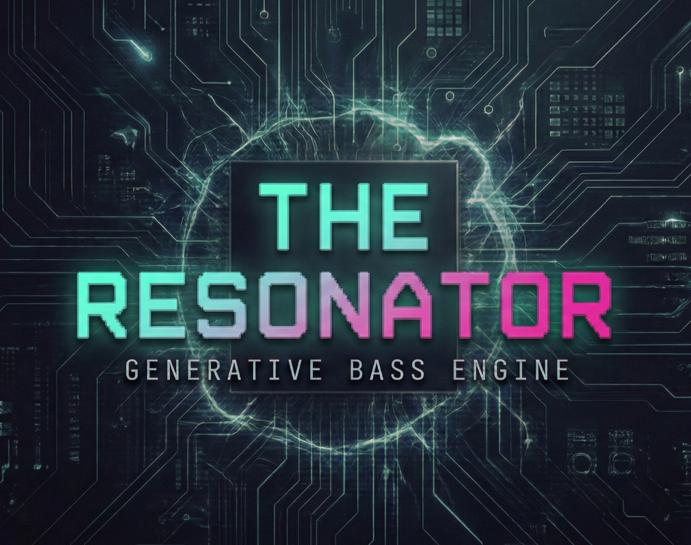
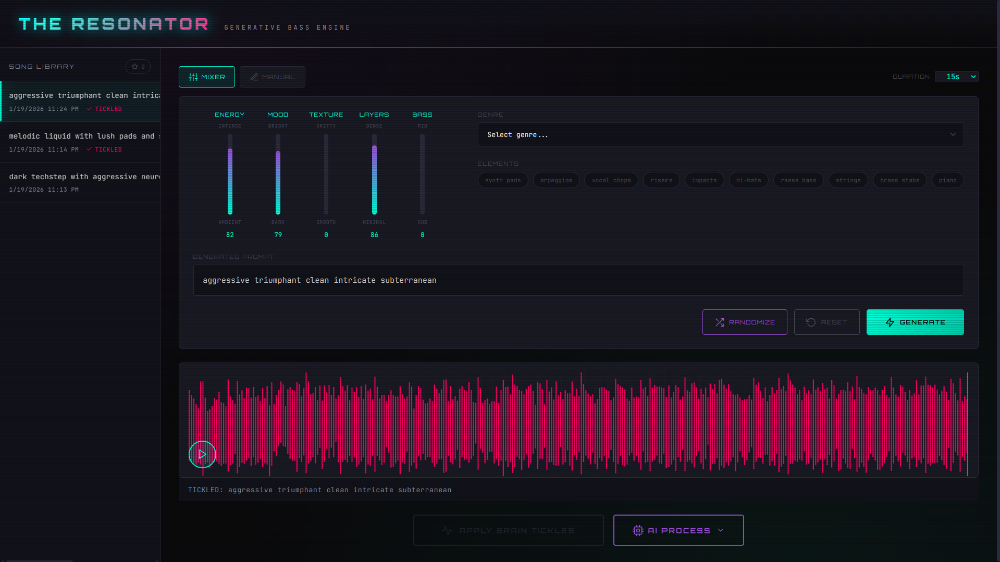

<p align="center">
  
</p>

# The Resonator

**A generative bass engine for turning the sounds in your head into reality.**

I grew up listening to drum & bass as teen in the 90s. Its stuck with me ever since. This project is an experiment to see how close we can get to replicating those sounds using nothing but natural language and modern AI.

> "dark neurofunk bassline with a rolling amen break"

Type what you hear. Get audio back. It's that simple.



## What Is This?

The Resonator is a full-stack generative audio application built on Meta's MusicGen model. Describe the sound in your head, and it generates audio. Apply "Brain Tickler" effects for that extra punch. Use AI-powered stem separation and denoising for post-processing.

**This is experimental.** Some prompts work better than others. The model has its quirks. But that's part of the fun—discovering what works and building on it.

## Features

- **Natural Language Generation** - Describe your sound, get audio
- **Brain Tickler Effects** - HighPass → Chorus → Compressor → Limiter chain
- **AI Processing** - Stem separation (Demucs) and denoising via Hugging Face
- **Track Library** - Persistent storage that survives restarts
- **Favorites** - Star your best generations for easy recall
- **Waveform Visualization** - See what you're hearing
- **AI Prompt Generator** - Need inspiration? Let AI suggest prompts

## Quick Start

**Requirements:** Docker, Docker Compose, NVIDIA GPU with ~8GB VRAM

```bash
# Clone the repo
git clone https://github.com/zheroz00/theResonator.git
cd theResonator

# Start it up
docker compose up --build -d

# Wait for model to load (first run downloads ~6GB)
docker compose logs -f backend
```

Open [http://localhost:6001](http://localhost:6001) and start creating.

## Usage

1. **Generate** - Type a prompt like "deep dubstep wobble bass 140bpm" and hit Generate
2. **Listen** - Click the waveform to play/pause, scrub to navigate
3. **Process** - Apply Brain Tickler effects or use AI processing for stems/denoising
4. **Save** - Star your favorites, rename tracks, build your library

## Architecture

```
┌─────────────────────────────────────────────────────────┐
│                    Frontend (React)                      │
│         Vite + WaveSurfer.js + nginx reverse proxy      │
└─────────────────────┬───────────────────────────────────┘
                      │ /api/*
┌─────────────────────▼───────────────────────────────────┐
│                   Backend (FastAPI)                      │
│  ┌─────────────┐  ┌─────────────┐  ┌─────────────────┐  │
│  │  MusicGen   │  │ Brain       │  │ Hugging Face    │  │
│  │  (generate) │  │ Tickler     │  │ API (stems,     │  │
│  │             │  │ (effects)   │  │ denoise)        │  │
│  └─────────────┘  └─────────────┘  └─────────────────┘  │
└─────────────────────────────────────────────────────────┘
```

## Configuration

Copy `.env.example` to `.env` for optional features:

```bash
# AI prompt generation (get key at https://openrouter.ai/keys)
VITE_OPENROUTER_API_KEY=your_key_here

# Hugging Face API (higher rate limits)
HF_API_TOKEN=your_token_here
```

## API

```bash
# Generate audio
curl -X POST http://localhost:6000/generate \
  -H "Content-Type: application/json" \
  -d '{"prompt": "neurofunk bass with reese growl", "duration": 15}'

# Apply effects
curl -X POST http://localhost:6000/process \
  -H "Content-Type: application/json" \
  -d '{"filename": "gen_abc123.wav"}'

# Health check
curl http://localhost:6000/health
```

## Roadmap

This is a living project. Some ideas for the future:

- [ ] More effect chains and presets
- [ ] Loop/pattern sequencing
- [ ] Real-time parameter tweaking
- [ ] Export to DAW-friendly formats
- [ ] Fine-tuned models for specific genres
- [ ] Community prompt sharing

## Contributing

Found a bug? Have an idea? Open an issue or PR. This is experimental territory—all contributions welcome.

## License

MIT License - see [LICENSE](LICENSE) for details.

---

<p align="center">
  <a href="https://buymeacoffee.com/zheroz00">
    
  </a>
</p>

<p align="center">
  Built with bass and caffeine along with my coding buddy, Claude.
</p>
